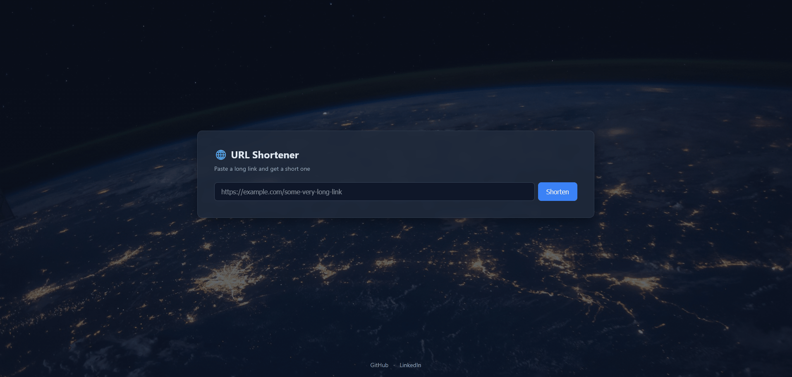
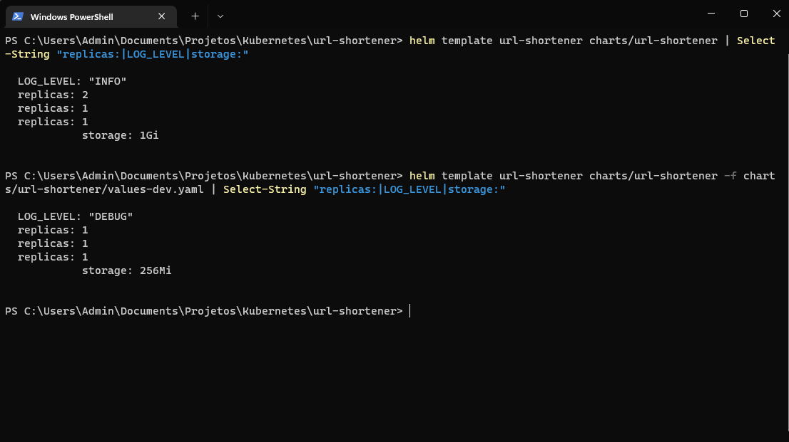
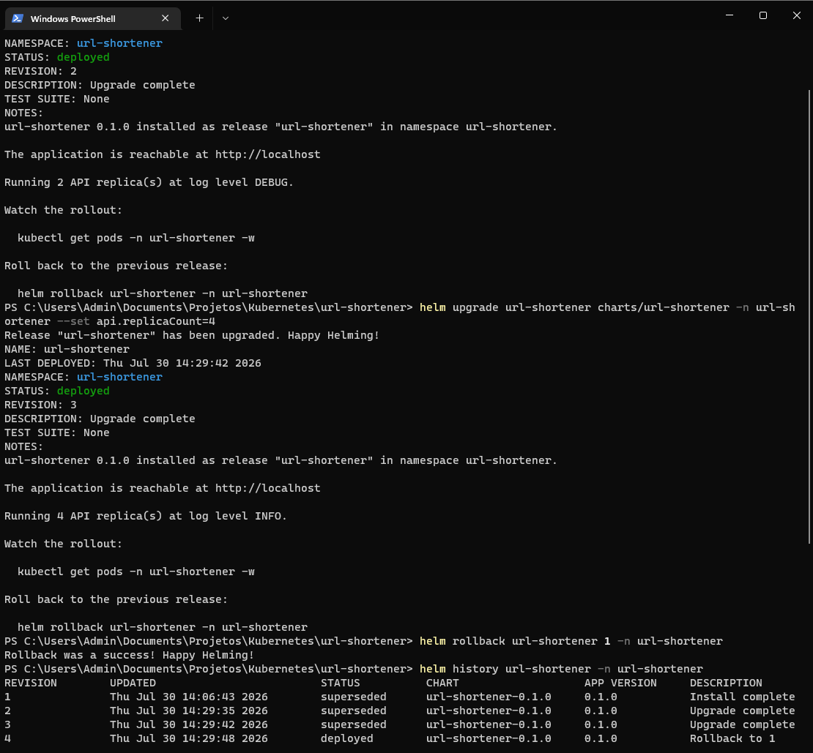
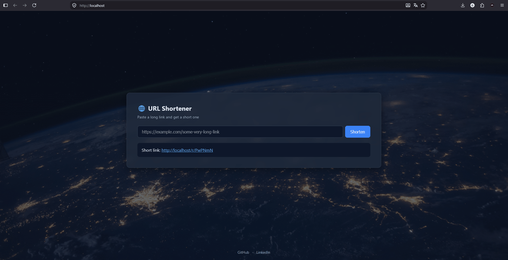
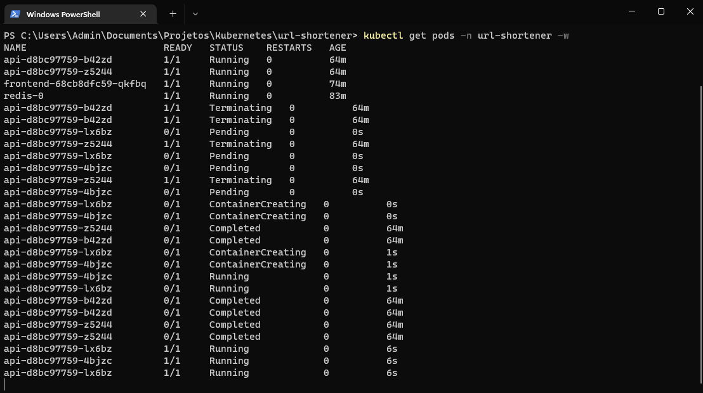
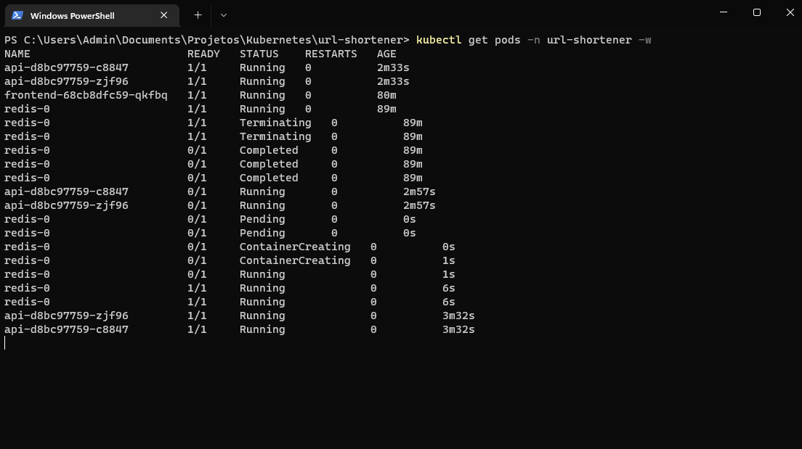
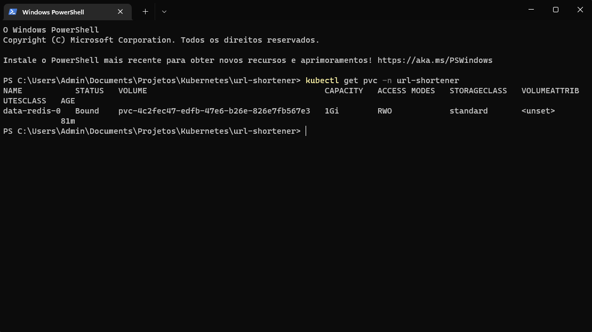
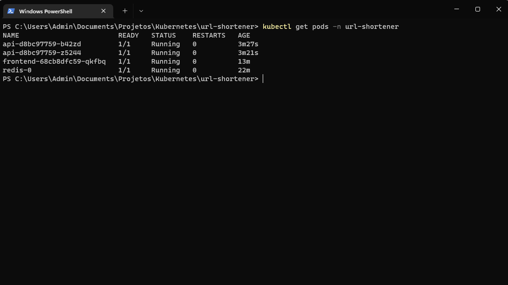
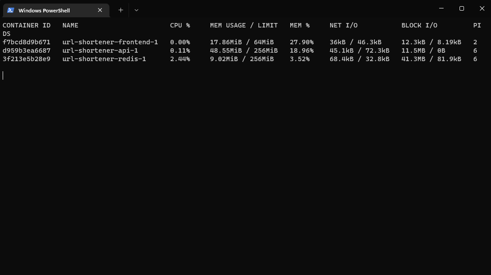
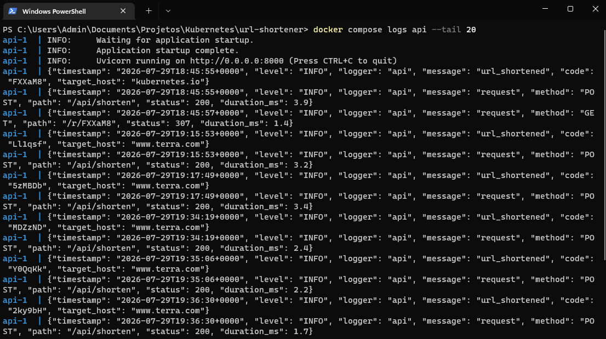

# URL Shortener

🇧🇷 [Versão em português](README.pt-BR.md)

A microservices URL shortener, packaged to run on Kubernetes with continuous
delivery via GitOps.



## Architecture

```
browser ──► frontend (nginx) ──► api (FastAPI) ──► redis
              proxies /api and /r    shortens and      stores
                                     redirects         the links
```

| Service  | Stack           | Responsibility                     |
|----------|-----------------|-------------------------------------|
| frontend | nginx, HTML/JS  | Web UI and reverse proxy            |
| api      | Python, FastAPI | Shortening and redirecting          |
| redis    | Redis 7         | Persistence of code → URL pairs     |

## Running locally

Requires Docker.

```bash
docker compose up --build
```

The application is available at **http://localhost:8080**.

## Running on Kubernetes (kind)

Requires [kind](https://kind.sigs.k8s.io/), `kubectl`, and [Helm](https://helm.sh/).

```bash
# Cluster with ports 80/443 mapped to localhost, plus the ingress controller
kind create cluster --name url-shortener --config kind-config.yaml
kubectl apply -f https://raw.githubusercontent.com/kubernetes/ingress-nginx/main/deploy/static/provider/kind/deploy.yaml
kubectl wait --namespace ingress-nginx --for=condition=ready pod \
  --selector=app.kubernetes.io/component=controller --timeout=120s

# Build the images and load them into the cluster
docker build -t url-shortener-api:0.1.0 ./api
docker build -t url-shortener-frontend:0.1.0 ./frontend
kind load docker-image url-shortener-api:0.1.0 --name url-shortener
kind load docker-image url-shortener-frontend:0.1.0 --name url-shortener

helm install url-shortener charts/url-shortener \
  --namespace url-shortener --create-namespace
```

### Environments and releases

The chart ships a base `values.yaml` plus per-environment overlays:

```bash
helm install url-shortener charts/url-shortener -n url-shortener --create-namespace \
  -f charts/url-shortener/values-dev.yaml     # 1 replica, DEBUG logs, smaller volume

helm template url-shortener charts/url-shortener \
  -f charts/url-shortener/values-prod.yaml    # render production output without applying

helm history url-shortener -n url-shortener   # revision history
helm rollback url-shortener 1 -n url-shortener
```

<details>
<summary>The same chart across environments, and rolling back a release</summary>

Rendering with the default values against the dev overlay — replicas, log
level, and volume size all follow the environment:



Two upgrades and a rollback, with every revision kept:



</details>

The application is available at **http://localhost**. The Ingress routes
`/api` and `/r` straight to the API service; everything else goes to the
frontend.



<details>
<summary>Self-healing, readiness draining, and persistent storage</summary>

Deleting every API pod: the Deployment schedules replacements immediately.



Redis scaled to zero: API pods drop to `0/1` and leave the Service rotation,
while `RESTARTS` stays at `0` — readiness drains traffic without liveness
restarting anything.



The Redis volume claim, bound and surviving pod restarts:



Steady state:



</details>

## API

| Method | Route               | Description                        |
|--------|---------------------|------------------------------------|
| `POST` | `/api/shorten`      | Shorten a URL                      |
| `GET`  | `/r/{code}`         | Redirect to the original URL       |
| `GET`  | `/api/stats/{code}` | Hit count for a short code         |
| `GET`  | `/healthz`          | Health check with Redis connectivity |

`/healthz` is exposed only on the API's internal port (`8000`), consumed by the
Compose healthcheck and by Kubernetes probes.

```bash
curl -X POST http://localhost:8080/api/shorten \
  -H "Content-Type: application/json" \
  -d '{"url": "https://kubernetes.io/docs/tutorials/"}'
```

```json
{ "code": "aB3xY9", "short_url": "/r/aB3xY9" }
```

Interactive documentation at `http://localhost:8080/api/docs`.

## Design decisions

**Reverse proxy in the frontend.** Nginx forwards `/api` and `/r` to the API,
keeping everything same-origin. This eliminates CORS configuration and mirrors
the role of an Ingress on Kubernetes.

**Configuration via environment variables.** The Redis address comes from
`REDIS_HOST`, with no hardcoded endpoint — the same image runs on Compose,
Kubernetes, or against a managed Redis.

**Dedicated health check.** `/healthz` validates Redis connectivity and serves
both the Compose healthcheck and Kubernetes liveness/readiness probes.

**Codes generated with `secrets`.** Random 6-character IDs instead of sequential
ones, preventing enumeration of shortened links. Writes use `SET NX` for
atomicity against collisions.

**Unprivileged container.** The API runs as a non-root user, a common
requirement of cluster security policies.

**Liveness and readiness probes with different scopes.** Readiness hits
`/healthz`, which checks Redis: an API pod without its store leaves the Service
rotation and receives no traffic. Liveness only checks the TCP port — if it
also depended on Redis, a Redis outage would cascade into a restart loop of
every API pod without fixing anything.

**Nginx config rendered by the chart, not baked into the image.** The API
service name carries the release prefix, so it is only known at install time.
The config lives in a ConfigMap mounted into the frontend pod, which also means
two releases can coexist in one cluster without colliding.

**Pod templates carry a checksum of their ConfigMap.** Changing a ConfigMap
does not restart pods on its own — the process keeps the old value in memory.
Hashing the rendered ConfigMap into a pod annotation makes any config change
produce a new pod template, so `helm upgrade` rolls the deployment
automatically.

**Redis as a StatefulSet.** Stable pod identity and a PersistentVolumeClaim per
replica keep the data across pod restarts; Deployments are reserved for the
stateless services.

**Structured JSON logs to stdout.** The API emits one JSON object per event —
access logs with latency, domain events, errors — following the twelve-factor
principle of treating logs as an event stream. `docker logs` (and later
`kubectl logs` and Loki) consume them without parsing hacks. Health check
requests are excluded to keep the stream free of probe noise, and only the
target host of shortened URLs is logged, never full query strings. Compose
caps the json-file driver at 3 × 10 MB per container.

**Resource constraints on every service.** CPU and memory limits mirror
Kubernetes `resources.limits/requests`. Redis runs with `maxmemory` below its
container limit and `noeviction` policy — it degrades with a clear error
instead of being OOM-killed or silently evicting shortened links.

<details>
<summary>Resource limits and structured logs in action</summary>

Memory usage against the configured limits:



JSON log entries with request latency and domain events:



</details>

## Roadmap

Each completed stage is tagged, so the raw manifests of one phase stay
browsable after a later phase replaces them.

- [x] Containerization and local orchestration with Docker Compose — [`phase-0-docker`](../../tree/phase-0-docker)
- [x] Kubernetes deployment: Deployments, Services, Ingress, and probes — [`phase-1-kubernetes`](../../tree/phase-1-kubernetes)
- [x] Helm packaging with per-environment configuration — [`phase-2-helm`](../../tree/phase-2-helm)
- [ ] Image build and publish pipeline with GitHub Actions
- [ ] Declarative continuous delivery with ArgoCD
- [ ] Metrics and dashboards with Prometheus and Grafana

## License

[MIT](LICENSE)

## Connect

Built by Guilherme Barbirato Escame while learning Kubernetes in the open.

[GitHub](https://github.com/guilhermeescame) ·
[LinkedIn](https://www.linkedin.com/in/guilherme-barbirato-escame-053bb6293/)
